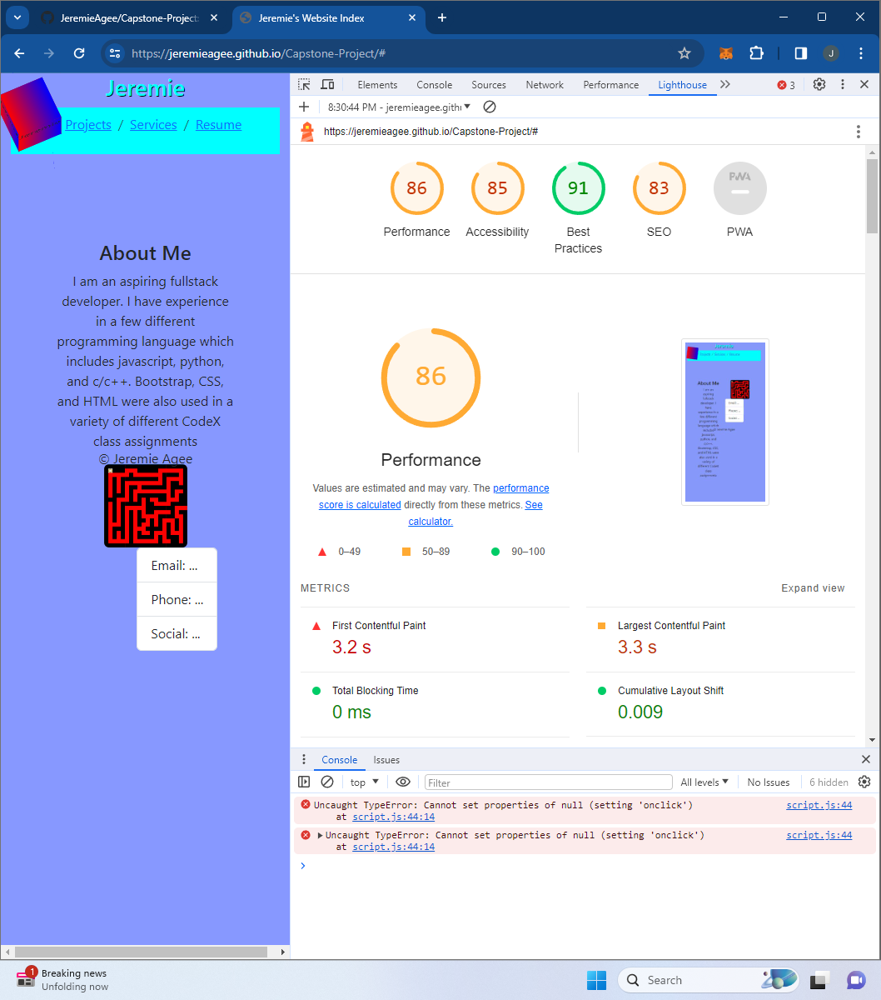

 
 When reviewing the lighthouse of the index page. I seen i could do more with alts on all of my imgs placed in the file currently there are none in place.
 
 As i ran thru the performance test. I noticed most of my performance hits were when i switched between the different html pages. 
 
 While reviewing the network performance of my pages what stood out the most was the javascript file loading around 160ms while everything else seemed to be under 80ms.